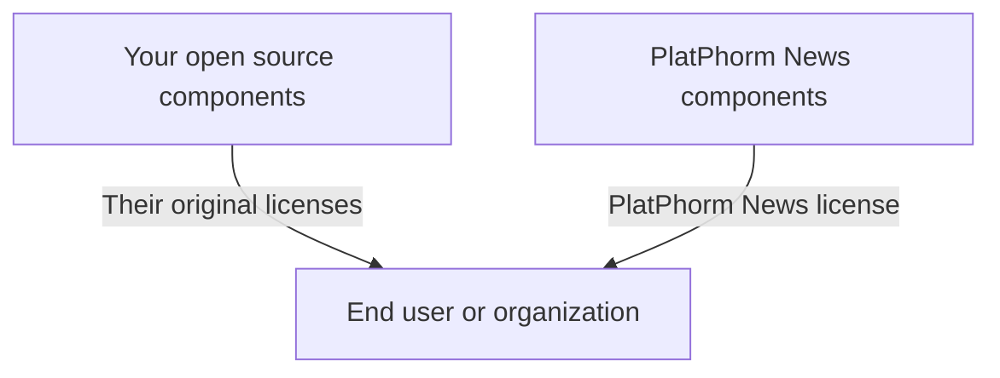

# PlatPhorm News Licensing FAQ

## What is covered by the permissive license?

Some PlatPhorm News repositories or components may be published under the permissive license in `LICENSE-PERMISSIVE.txt`. That license is suitable for components PlatPhorm News wants broadly reused with minimal friction, such as interoperability helpers, public specifications, reference clients, examples, small libraries, and similar building blocks.

Those permissive components may generally be used, modified, and redistributed under the stated terms, including in commercial settings, so long as the notice and attribution requirements are preserved and no endorsement is implied.

## What is covered by the PlatPhorm News Network License?

All repositories, packages, schemas, prompts, datasets, templates, site code, automation flows, API definitions, MCP integrations, discovery files, network manifests, llms.txt assets, and related materials that PlatPhorm News designates under `LICENSE.txt` are covered by the PlatPhorm News Network License 1.0.

That license allows source-available use, modification, study, testing, research, and non-commercial redistribution. It does not allow monetization or commercial exploitation without separate written permission from PlatPhorm News.

## Why use this structure?

This structure makes it possible to publish substantial parts of the ecosystem in public while preserving commercial rights, repository identity, authorship, and network integrity for the parts that define the platform itself.

It supports open collaboration, research, experimentation, interoperability, and community review while reserving paid productization, hosted commercialization, OEM arrangements, white-label use, and revenue-generating deployments to PlatPhorm News unless separately approved.

## Can I use the network-licensed software inside my organization?

Yes, if your use is non-commercial as defined by the license. Internal evaluation, research, development, testing, security review, accessibility work, and internal experimentation are generally allowed if you are not directly or indirectly monetizing the software or a service built on it.

## Can I use it in a paid product, client engagement, SaaS, service bureau, managed service, consulting deliverable, or hosted platform?

No, not under the default network license.

If you want to use network-licensed software in any commercial or revenue-generating context, you need separate written permission from PlatPhorm News.

## Can I fork it?

Yes. You may fork, inspect, and modify network-licensed repositories for non-commercial purposes. If you redistribute them, you must keep the license terms, notices, and attribution intact.

## Can I combine it with other open source software?

Usually yes, but you must preserve the license notices for each component separately.

Open source licenses generally fall into three broad groups:

- **Permissive** licenses such as BSD, MIT, and Apache.
- **Weak copyleft** licenses such as LGPL, EPL, CDDL, and MPL.
- **Strong copyleft** licenses such as GPL and AGPL.

The PlatPhorm News Network License does not by itself prohibit combination. The practical constraints often come from the other license involved, especially copyleft licenses.

## What happens with GPL or AGPL combinations?

The rules for combining GPL or AGPL code with network-licensed software are driven primarily by the GPL or AGPL terms, not by PlatPhorm News.

As a general matter, if components are distributed together in a way that creates a single combined work under GPL-style rules, you should expect compatibility questions. In many cases, separation through clearly independent processes, APIs, sockets, command boundaries, or separately distributed plugins may reduce that risk, but you should not rely on that without legal review.

This FAQ is informational only and not legal advice.

## If I redistribute a mixed project, how should I do it?

Preserve the notices for each component. A common pattern is:

Do not relabel PlatPhorm News licensed code as though it were solely under your project’s license. Keep the licensing boundaries clear in the repository, package metadata, notices, and documentation.

## What about prompts, schemas, manifests, generated templates, discovery files, and automation flows?

Unless PlatPhorm News explicitly marks those materials under the permissive license, treat them as covered by the PlatPhorm News Network License when they are distributed with a repository or service under `LICENSE.txt`.

## Can I use the name of PlatPhorm News or related brands for my own project?

No. The license does not grant trademark or branding rights beyond truthful attribution.

You may identify the origin of the software, but you may not imply sponsorship, endorsement, affiliation, certification, or official status without specific prior written permission.

## Who owns the original code and platform materials?

PlatPhorm News retains ownership of the original software and associated intellectual property made available under the network license. You retain ownership of your own original modifications, but redistribution must preserve PlatPhorm News rights in the original portions.

## What about contributions back upstream?

Unless a separate written agreement says otherwise, intentionally submitted contributions for inclusion upstream grant PlatPhorm News broad rights to use, distribute, relicense, and commercialize those contributions as part of the platform and related works.

## Can PlatPhorm News publish different repositories under different licenses?

Yes. PlatPhorm News may designate some repositories or components under the permissive license and others under the network license. Always check the repository root, package metadata, and notices for the governing license.

## Is this legal advice?

No. This FAQ is a practical explanation of the intended licensing model and is not legal advice. For material commercial use, licensing compatibility questions, or high-risk distribution scenarios, consult qualified counsel.
